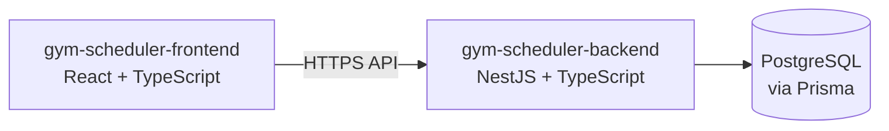

# GYM_SCHEDULER Repositories

No code repositories have been created yet. The planned repository structure is:

| Repository | Purpose | Technology | Relationship |
|------------|---------|------------|--------------|
| `gym-scheduler-frontend` | Login experience and editable seven-card gym schedule UI | React + TypeScript | Calls the backend API for authentication, schedules, and exercises |
| `gym-scheduler-backend` | Authentication, schedule and exercise APIs, validation, and persistence | NestJS + TypeScript, Prisma, PostgreSQL | Serves the frontend and owns the database schema and migrations |

## Planned Relationship

Remote repository hosting and CI configuration will be selected when implementation begins.
