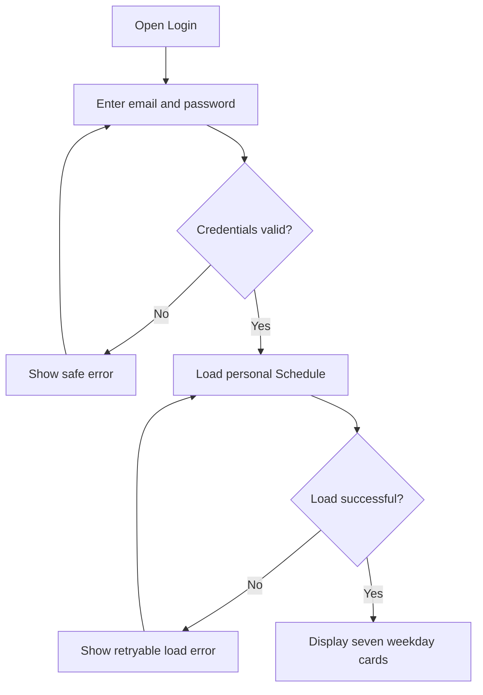
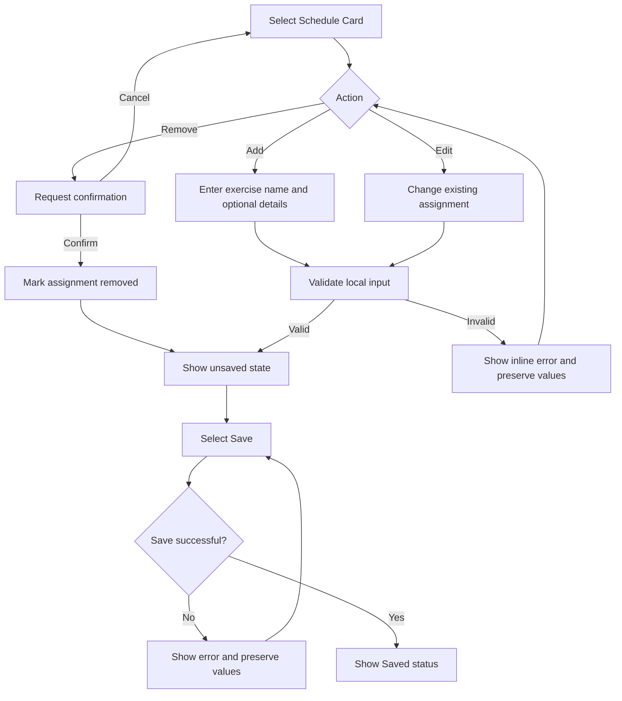

# User Flows: GYM_SCHEDULER

**Status**: Minimal prototype flows — draft  
**Created**: 2026-09-07  
**Persona**: [Individual Gym Member](personas-gym-scheduler.md)  
**Concept**: Simple Weekly Board

## Flow Inventory

| ID | Flow | Priority |
|---|---|---|
| F-001 | Log in and view personal weekly schedule | High |
| F-002 | Add an exercise to a Schedule Card | High |
| F-003 | Edit and save an Exercise Assignment | High |
| F-004 | Remove an Exercise Assignment | High |
| F-005 | Recover from authentication or save failure | High |
| F-006 | Log out | Medium |

## Flow Diagrams

### F-001: Log in and view schedule

### F-002/F-003/F-004: Manage an exercise

## Decision Points

| Decision | Yes path | No path |
|---|---|---|
| Credentials valid? | Load personal schedule. | Show safe login error. |
| Schedule load successful? | Display seven cards. | Offer retry without exposing data. |
| Add/edit input valid? | Show unsaved change. | Show inline validation and preserve values. |
| Remove confirmed? | Remove assignment locally and mark unsaved. | Leave assignment unchanged. |
| Save successful? | Show Saved and keep the user on the board. | Preserve values and allow intentional retry. |
| Session valid? | Continue protected interaction. | Return to Login. |

## Error Handling

- Invalid credentials: safe error that does not unnecessarily reveal account existence.
- Expired/invalid session: deny protected access and return to Login.
- Schedule load failure: show a retry action and do not display incomplete private data as current.
- Missing exercise name: show inline validation.
- Save failure: preserve values, show a clear error, and avoid blind duplicate-write retries.
- Unauthorized schedule request: reject the request without revealing another user’s data.
- Network interruption: retain recoverable local form state until the user retries or leaves.

## Success Criteria

- User reaches the personal seven-card board after valid authentication.
- User can add, edit, remove, and save an exercise assignment.
- User receives visible and accessible status feedback.
- User can recover from invalid input and failed saves without losing values.
- Confirmed changes remain available after refresh or renewed login.
- Cross-user access is denied.

## Validation Status

| Flow | Status | Evidence |
|---|---|---|
| F-001 | Inferred | PRD and journey map; no user research yet. **[INF]** |
| F-002 | Inferred | PRD and domain rules. **[INF]** |
| F-003 | Inferred | PRD and refined concept. **[INF]** |
| F-004 | Inferred | PRD and refined concept. **[INF]** |
| F-005 | Inferred | Technical feasibility and compliance requirements. **[INF]** |
| F-006 | Inferred | PRD prototype scope. **[INF]** |

**Last Updated**: 2026-09-07  
**Prepared By**: Explore Agent, inline fallback because the specialized user-flow skill was unavailable
