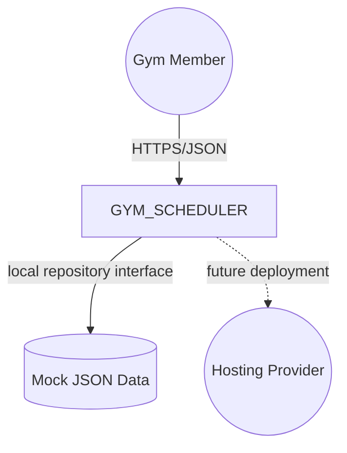
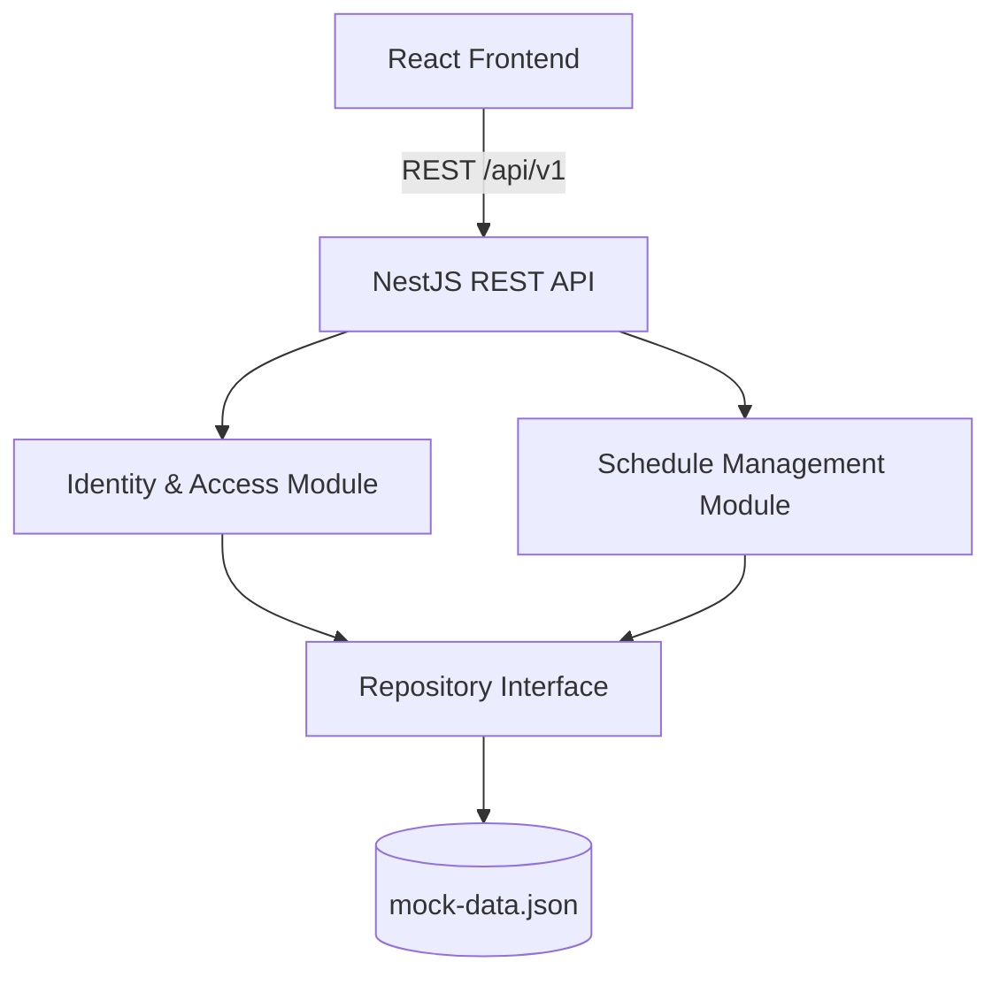
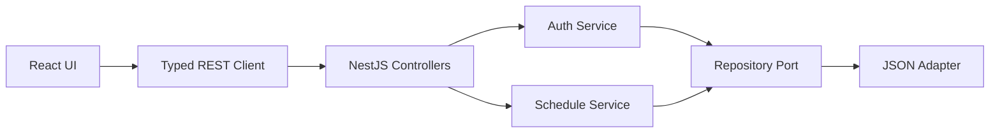
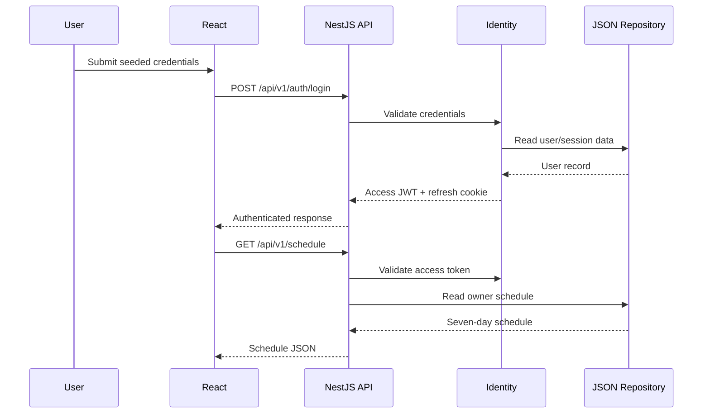
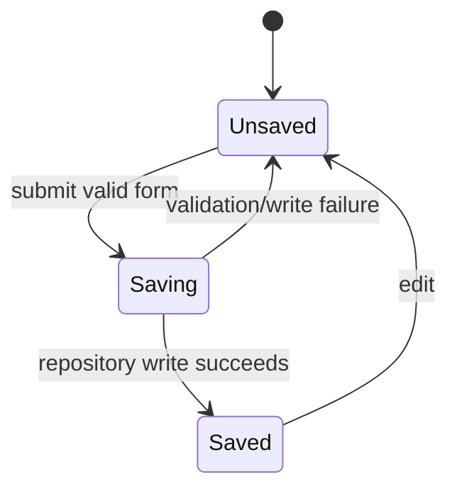

# GYM_SCHEDULER — High-Level Design

**Slug**: `gym-scheduler`  
**Version**: 0.1  
**Status**: SOCIALIZATION-READY  
**Date**: 2026-09-09  
**Author**: Explore Agent / Calin

## 1. Executive Summary

### 1.1 Purpose

GYM_SCHEDULER is a local web prototype that lets an authenticated gym member manage one personal weekly workout schedule with exactly seven editable weekday cards. It addresses R-001 through R-009. [OBS]

### 1.2 Objectives & Business Value

- Make weekly planning clear and easy to understand. [OBS]
- Make exercise maintenance fast and recoverable. [OBS]
- Test whether a scheduler increases perceived gym membership value. [OBS]
- Meet NFR-001 through NFR-010 for prototype acceptance. [OBS]

### 1.3 Scope & Non-goals

In scope: seeded login, one schedule per user, seven days, exercise add/edit/remove, explicit save, responsive React UI, NestJS REST API, and JSON mock persistence. [OBS]

Out of scope: registration, password recovery, MFA, payments, trainer/admin workflows, external integrations, native mobile apps, offline editing, real-time sync, production hosting, and runtime database storage. [OBS]

### 1.4 Key Architecture Decisions

- NestJS modular monolith — see [ADR-001](../decisions/gym-scheduler-adr-001-modular-monolith.md).
- JSON repository behind an interface — see [ADR-002](../decisions/gym-scheduler-adr-002-json-repository.md).
- Typed REST client with local React state — see [ADR-003](../decisions/gym-scheduler-adr-003-typed-rest-client.md).
- In-memory access JWT with rotating refresh cookie — see [ADR-004](../decisions/gym-scheduler-adr-004-secure-session.md).

### 1.5 System Identifier

Canonical slug: `gym-scheduler`; product name: `GYM_SCHEDULER`. [OBS]

## 2. System Overview

### 2.1 Business Context and Responsibilities

The system provides a focused weekly planning tool for individual gym members. Identity & Access owns authentication state. Schedule Management owns schedule, day, exercise, ordering, and ownership rules. [OBS]

### 2.2 Stakeholders

- Individual gym member: uses login and schedule editing. [OBS]
- Calin, Product Owner: validates product usefulness and acceptance. [OBS]
- Delivery team: implements and tests the prototype. [INF]

### 2.3 Requirements

Functional requirements are R-001 through R-009: login, schedule retrieval, exercise CRUD, save, logout, responsive presentation, and accessible feedback. [OBS]

Quality requirements are NFR-001 through NFR-010: response time, page readiness, secure credentials, ownership checks, token rejection, persistence after refresh, recoverable failures, WCAG 2.2 AA, responsive width, and automated quality checks. [OBS]

### 2.4 System Boundary and External Interactions

Inside: React client, NestJS API, Identity & Access, Schedule Management, shared contracts, and JSON repository. [OBS]

External or deferred: browser, local filesystem, future hosting provider, and future PostgreSQL persistence. No external business integration is required. [OBS]

### 2.5 Context Diagram



## 3. Architecture Principles

- Clear ownership: Identity & Access does not own schedules; Schedule Management does not own credentials. [OBS]
- Simple infrastructure: no database, queue, cache, or event bus is introduced without a workload need. [OBS]
- Replaceable persistence: domain logic depends on a repository interface, not JSON file details. [OBS]
- Secure by baseline: access tokens remain in memory and refresh tokens use Secure, HttpOnly, SameSite cookies. [OBS]
- Accessible by default: semantic controls, keyboard operation, visible focus, and announced status support NFR-008. [OBS]
- Prototype deviation: JSON storage is single-process and not a production durability strategy; this is intentional and tracked by BLK-003/open questions. [ASM]

## 4. Technology Stack

### 4.1 Core Technologies

- Frontend: React + TypeScript. [OBS]
- Backend: NestJS + TypeScript. [OBS]
- API: REST/JSON with `/api/v1`. [OBS]
- Runtime storage: JSON file behind a TypeScript repository interface; no MongoDB or PostgreSQL runtime dependency. [OBS]
- Tests: Vitest + React Testing Library for frontend, Jest + Supertest for backend, Playwright for end-to-end flows. [OBS]

### 4.2 Platform / Cloud Services

None required locally. Hosting provider, deployment region, and production persistence are TBD before deployment. [ASM]

### 4.3 Development & Libraries

Use framework-native NestJS validation and guards, typed shared DTOs, and lightweight React components. Additional libraries require justification against the prototype simplicity goal. [INF]

### 4.4 Configuration Management

Local environment variables hold JWT secrets, cookie settings, ports, and CORS configuration. Secrets are never committed. Production configuration is deferred. [OBS]

## 5. High-Level Architecture

### 5.1 Context View

The browser calls the local REST API. The API authenticates and authorizes the request, invokes the relevant domain module, and reads or writes the JSON repository. [OBS]

### 5.2 Container / Service Diagram



### 5.3 Container / Service Responsibilities

- React Frontend: renders login and seven cards, owns UI/form state; does not read JSON or decide authorization. [OBS]
- REST API: routes requests, validates DTOs, and maps responses; does not contain persistence logic. [OBS]
- Identity & Access: handles seeded login, JWTs, refresh, logout, and authorization context; does not own schedule data. [OBS]
- Schedule Management: enforces one schedule, seven days, exercise rules, ordering, and ownership; does not issue credentials. [OBS]
- Repository Interface/JSON Adapter: persists prototype records; does not authenticate or apply product rules. [OBS]

## 6. Component Architecture

The backend is a modular monolith with Identity, Schedule, Repository, and API modules. The frontend has authentication state, schedule state, typed API client, and accessible presentation components. [OBS]



Cross-cutting concerns: DTO validation at API boundaries, authorization guards before schedule operations, structured logs without secrets, and explicit save/error states. No cache, retries, queue, or event bus is required. [OBS]

## 7. Runtime View

### 7.1 Login and Schedule Load



### 7.2 Exercise Save and Failure

The client submits an exercise command. The API validates ownership and fields, writes the JSON repository, and returns the updated day. On validation or write failure, the API returns a safe error and the UI keeps entered values for retry. [OBS]

## 8. Data & Domain Model

### 8.0 Bounded Contexts

- Identity & Access: seeded users, roles, credentials, access tokens, and refresh sessions. [OBS]
- Schedule Management: one weekly schedule, exactly seven ordered days, and ordered exercises. [OBS]

The contexts interact through authenticated user identity. They do not share ownership of the same business rules. [OBS]

### 8.1 Domain Concepts

User owns one Weekly Schedule. A Weekly Schedule owns seven Schedule Cards. A Schedule Card owns ordered Exercises. Exercise name is mandatory; muscle group, sets, repetitions, rest time, difficulty, and instructions are optional and validated when supplied. [OBS]

### 8.2 Data Model & Persistence

```text
User 1 ── 1 WeeklySchedule 1 ── 7 ScheduleDay 1 ── * Exercise
User 1 ── * RefreshSession
```

The JSON file stores seeded users, schedules, exercises, and refresh-session records for the local prototype. The repository port is the replacement seam for future PostgreSQL persistence. [OBS]

### 8.3 Indexing & Access Patterns

The prototype performs lookups by user ID, schedule ID, day ID, and exercise ID. No database indexes are required for the small JSON dataset. A future database adapter must index ownership and relationship keys. [INF]

### 8.4 State Transitions



These are user-visible UI states, not persisted domain states. [OBS]

## 9. Quality Attributes

- Performance: target NFR-001 and NFR-002 with a small local dataset and simple request path. [OBS]
- Security: NFR-003, NFR-004, and NFR-005 are addressed by hashing, protected routes, ownership checks, in-memory access JWTs, and secure refresh cookies. [OBS]
- Persistence: NFR-006 is addressed by JSON writes and reload tests; multi-process durability is not promised. [ASM]
- Resilience: NFR-007 is addressed by preserving client form state after failed saves. [OBS]
- Accessibility and responsive use: NFR-008 and NFR-009 are addressed with semantic controls, keyboard support, visible focus, responsive stacking, and no hover-only actions. [OBS]
- Maintainability: NFR-010 is addressed with typed contracts, unit/API/E2E tests, linting, formatting, and repository isolation. [OBS]
- Observability: structured logs and basic metrics cover authentication, schedule reads, mutations, validation errors, and latency. [INF]

## 10. Operational Concerns

The prototype runs locally as one frontend process and one backend process. No staging environment is required. [OBS]

Configuration is environment-based. The JSON file must be writable by the backend process and is not safe for multiple concurrent writers. [ASM]

Failure modes include invalid credentials, expired sessions, unauthorized schedule access, validation errors, and JSON write failures. The API returns safe errors; the frontend preserves recoverable input. [OBS]

Production rollout, rollback, alerting, and provider topology remain TBD before deployment. [ASM]

## 11. API & Integration Contracts

Main endpoints:

- `POST /api/v1/auth/login`
- `POST /api/v1/auth/refresh`
- `POST /api/v1/auth/logout`
- `GET /api/v1/me`
- `GET /api/v1/schedule`
- `PUT /api/v1/schedule/days/:dayId`
- `POST /api/v1/schedule/days/:dayId/exercises`
- `PUT /api/v1/schedule/days/:dayId/exercises/:exerciseId`
- `DELETE /api/v1/schedule/days/:dayId/exercises/:exerciseId`

Errors use JSON with a stable message/code shape. Schedule writes are owner-scoped and should be idempotent by resource and command semantics; no blind automatic retries are used. [INF]

There are no asynchronous events or external integrations in the prototype. [OBS]

## 12. Risks, Trade-offs, and Open Questions

### 12.1 Risks

| Risk | Severity | Mitigation | Owner |
|---|---|---|---|
| Ownership check exposes another user’s schedule | HIGH | Central guard and negative API tests | Calin / Delivery |
| JSON concurrent writes corrupt or lose data | MEDIUM | Single-process declaration and repository seam | Delivery |
| Secure session behavior is implemented incorrectly | HIGH | API/security tests and cookie review | Delivery |
| Seven cards are difficult on small screens | MEDIUM | Responsive layout and viewport tests | Delivery |
| Failed save loses user input | MEDIUM | Preserve form state and retry | Delivery |

### 12.2 Trade-offs

- JSON storage gives prototype speed at the cost of production durability and concurrency; see ADR-002. [OBS]
- A modular monolith gives simple delivery at the cost of independent service scaling; see ADR-001. [OBS]
- Local React state avoids a data library at the cost of hand-written request state; see ADR-003. [OBS]
- Secure refresh flow adds implementation work but protects the approved prototype session model; see ADR-004. [OBS]

### 12.3 Open Questions

| # | Question | Owner | Target Resolution |
|---|---|---|---|
| Q1 | Which hosting provider/accounts/regions will be used? | Calin | Before deployment |
| Q2 | When should PostgreSQL replace JSON storage? | Calin / Engineering | Before persistence integration |
| Q3 | Is multi-process JSON writing required? | Engineering | Before scaling |
| Q4 | Which seeded demo credentials should be shown? | Calin | Before demo handoff |

### 12.4 Assumptions

- One local backend process is sufficient. [ASM]
- Same-origin or configured local CORS is available. [ASM]
- Seeded demo roles and credentials are sufficient. [OBS]
- Current major Chrome, Edge, Firefox, and Safari versions are the browser baseline. [OBS]

## 13. Future Enhancements

- PostgreSQL persistence: triggered by deployment or multi-process needs; repository port already exists; Medium effort. [ASM]
- Registration and account recovery: triggered by real-user pilot; Identity boundary can expand; Medium effort. [OBS]
- Hosting and CI/CD: triggered by public demo; provider configuration is intentionally deferred; Medium effort. [ASM]
- Membership Value analytics: triggered by product evaluation; add event/analytics integration without changing schedule ownership; Medium effort. [OBS]
- Exercise catalog and richer metadata: triggered by user feedback; extend exercise validation and UI; Low/Medium effort. [OBS]

## 14. Enrichment Log and Document History

### 14.1 Enrichment Log

| Date | Change | Source | Updated By |
|---|---|---|---|
| 2026-09-09 | JSON storage and deferred database recorded | DEC-003 | Explore Agent / Calin |
| 2026-09-09 | Boundary map and design sketch approved | B.1 workflow | Explore Agent / Calin |
| 2026-09-09 | HLD direction approved through architecture gates | B.2 workflow | Explore Agent / Calin |

### 14.2 Document History

| Version | Date | Author | Changes | Reviewed By |
|---|---|---|---|---|
| 0.1 | 2026-09-09 | Explore Agent | Initial consolidated HLD draft | Calin |

## Traceability

- PRD: [gym-scheduler-prd.md](../prds/gym-scheduler-prd.md)
- Boundary map: [gym-scheduler-boundary-map.md](gym-scheduler-boundary-map.md)
- Truth hierarchy: [gym-scheduler-truth-hierarchy.md](gym-scheduler-truth-hierarchy.md)
- Design sketch: [gym-scheduler-design-sketch.md](gym-scheduler-design-sketch.md)
- Decision log: [gym-scheduler-decision-log.md](gym-scheduler-decision-log.md)
- Blocker register: [gym-scheduler-blocker-register.md](gym-scheduler-blocker-register.md)
- Hardening report: [gym-scheduler-hardening-report.md](gym-scheduler-hardening-report.md)
- Backport findings: [gym-scheduler-backport-findings.md](gym-scheduler-backport-findings.md)

### ADR Index

- ADR-001: [Modular Monolith](../decisions/gym-scheduler-adr-001-modular-monolith.md)
- ADR-002: [JSON Repository](../decisions/gym-scheduler-adr-002-json-repository.md)
- ADR-003: [Typed REST Client](../decisions/gym-scheduler-adr-003-typed-rest-client.md)
- ADR-004: [Secure Session](../decisions/gym-scheduler-adr-004-secure-session.md)
