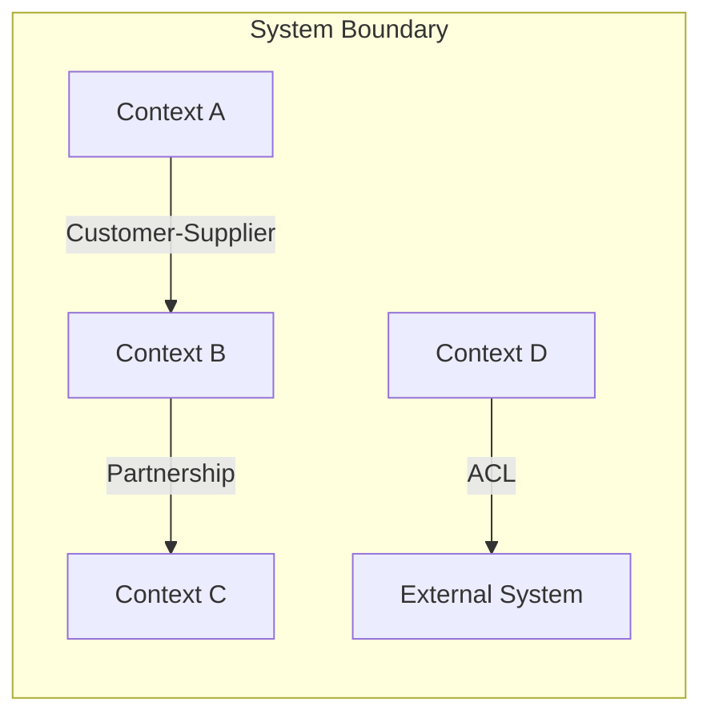
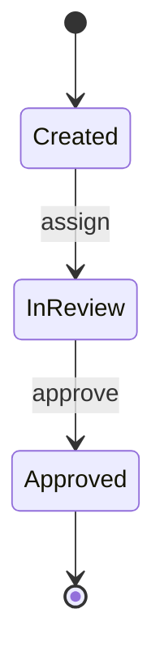

# Step 4: Model Domain (Light)

## Objective

Apply Domain-Driven Design to identify bounded contexts, define context relationships, and sketch core aggregates. This is a **light** domain model to inform solutioning — not a full DDD exercise. If Activity 3 (Domain Analysis) also ran, consolidate with `domain-analysis.md` rather than duplicating.

## Entry Criteria

- [ ] Step 3 complete — architecture drivers extracted and validated

## Explore Type Gate

| Explore Type | Action |
|---|---|
| **Fast Lane** | ❌ **Skip this step entirely** — defer domain modeling to solutioning (Step 5). Proceed to Step 5. |
| **ERC** | ⚠️ Light — bounded contexts and context map only. Skip aggregate design. |
| **Diverge/Converge** | ✅ Full DDD: bounded contexts + context map + aggregate sketch |

## Actions

### 4.1 Check for Existing Domain Analysis

**If `explore/explore-[slug]/domain-analysis.md` exists** (Activity 3 ran):
- Read and extract: entity relationships, bounded context hypotheses, domain glossary
- Use as the **starting point** — do not recreate from scratch
- This step enriches the existing domain model with architecture-relevant perspective (ownership, integration points, consistency boundaries)
- Any new bounded contexts or relationships discovered here are **appended** to the existing model

**If no domain analysis exists**:
- Build bounded context hypotheses from: PRD requirements (via `context.md`), functional drivers (Step 3), ingested architecture documents (Step 1)

### 4.2 Identify Bounded Contexts

For each bounded context:
- **Name** — a clear, domain-meaningful name
- **Core responsibility** — what business capability this context owns
- **Key domain concepts** — the entities and value objects that live here
- **Data ownership** — what data this context is the source of truth for
- **Evidence** — which artifact(s) support this boundary [OBS/INF/ASM]

**Guidance**: If functional drivers from Step 3 map to distinct business capabilities with different vocabularies, these are likely separate bounded contexts. Merge contexts that share the same ubiquitous language; split contexts where the same term means different things.

### 4.3 Draw Context Map

Define the relationships between bounded contexts using DDD context mapping patterns:

| Pattern | When to Use |
|---------|-------------|
| **Partnership** | Two contexts evolve together; teams collaborate closely |
| **Customer–Supplier** | Upstream context provides; downstream context consumes |
| **Conformist** | Downstream accepts upstream's model without translation |
| **Anti-Corruption Layer (ACL)** | Downstream translates upstream's model to protect its own |
| **Open Host Service** | Context exposes a well-defined API for multiple consumers |
| **Published Language** | Shared schema or event format across contexts |
| **Separate Ways** | Contexts have no integration — they are independent |

Produce a **Mermaid context map diagram**:



### 4.4 Sketch Core Aggregates (Diverge/Converge only)

**Skip for ERC** — proceed to 4.5.

For each bounded context, identify the **aggregate roots**:

For each aggregate:
- **Aggregate root** — the entity that controls access
- **Invariants** — business rules that must always be true within this aggregate
- **Lifecycle** — creation, state transitions, termination
- **Events emitted** — what domain events this aggregate produces when its state changes

**State machine identification**: If functional drivers or ingested documents define state transitions, draw a state diagram for each stateful aggregate:



### 4.5 Establish Ubiquitous Language Additions

Extract key domain terms discovered during this step. Cross-reference with:
- `explore/glossary.md` (if exists)
- `domain-analysis.md` Domain Glossary (if Activity 3 ran)

Only add **new terms** not already in the glossary. For each new term:
- **Term** — the canonical name
- **Bounded context** — where this term is used
- **Definition** — precise, unambiguous meaning
- **Source** — which document or artifact this term came from [OBS/INF]

### 4.6 Validate Domain Model Against Drivers

Cross-check the domain model against the architecture drivers from Step 3:

- [ ] Every MUST-have functional driver maps to at least one bounded context
- [ ] Every bounded context has a clear data ownership boundary
- [ ] No bounded context has conflicting quality attribute requirements (if it does, consider splitting)
- [ ] The context map relationships align with organizational boundaries (from landscape)

## Checkpoint

Present the domain model to the human:

```
Domain Model (Light):

Bounded contexts: [N]
  • [Context A] — owns: [data] — responsibility: [capability]
  • [Context B] — owns: [data] — responsibility: [capability]

Context map relationships: [N]
New glossary terms: [N]
Driver coverage: [N]/[N] MUST drivers mapped to bounded contexts

Gaps:
  1. [Gap] — driver [X] has no clear bounded context
  2. [Gap] — [description]
```

**STOP**: Get human confirmation of the domain model before proceeding.

## Exit Criteria

- [ ] Bounded contexts identified with responsibilities and data ownership
- [ ] Context map drawn with relationship patterns (Mermaid diagram)
- [ ] Core aggregates sketched (D/C only) with state machines for stateful entities
- [ ] New glossary terms documented (not duplicating existing glossary)
- [ ] Domain model validated against architecture drivers
- [ ] Consolidated with `domain-analysis.md` if Activity 3 also ran
- [ ] Human has approved the domain model

## Next Step

→ [05-write-architecture-context.md](./05-write-architecture-context.md)

<!-- dft:verified:WIgNND1p3slf/WxOrVgSCotLNtT/vIgMQYYEGjC9JsQ=:explore.proc.architecture-context:1.0.1:2026-09-07T13:12:02Z -->
