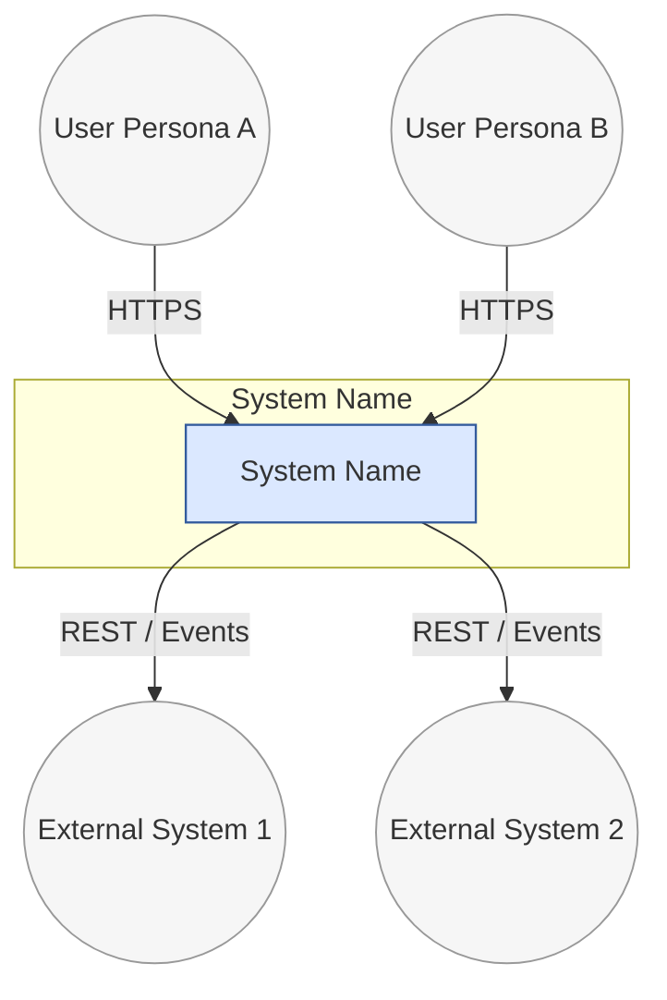
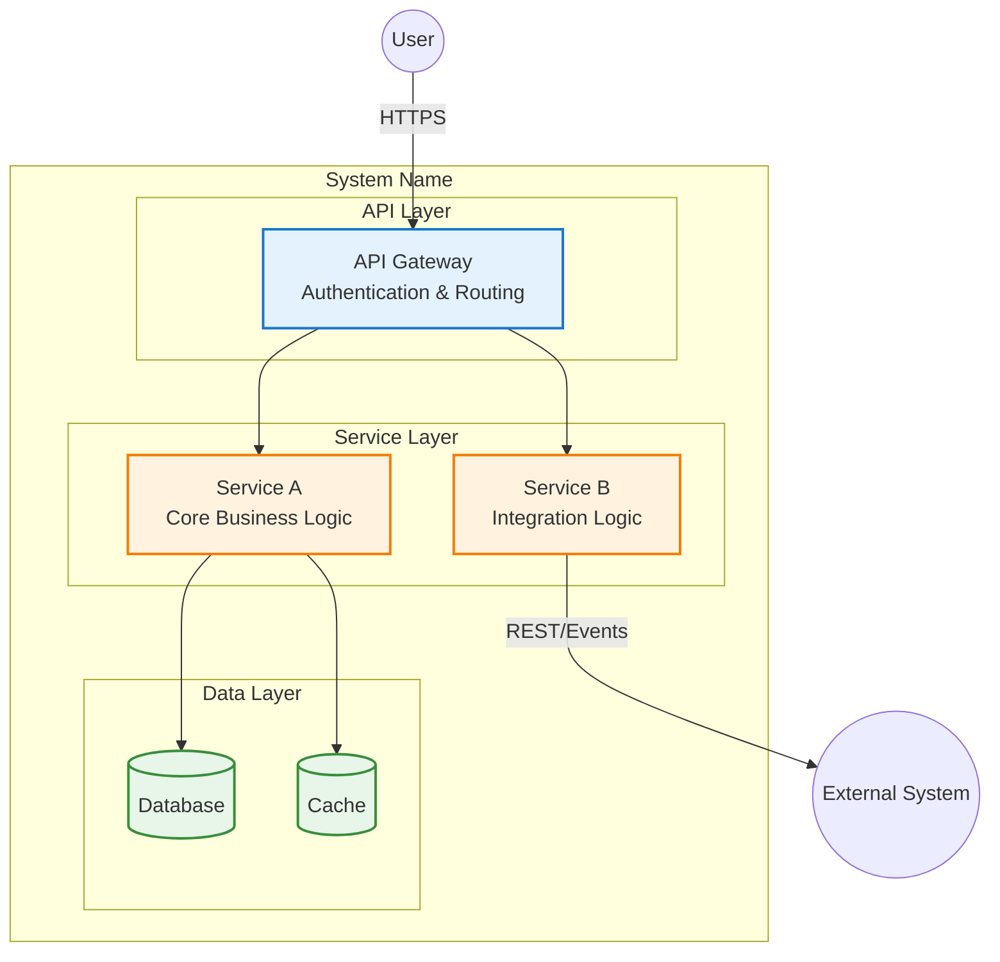
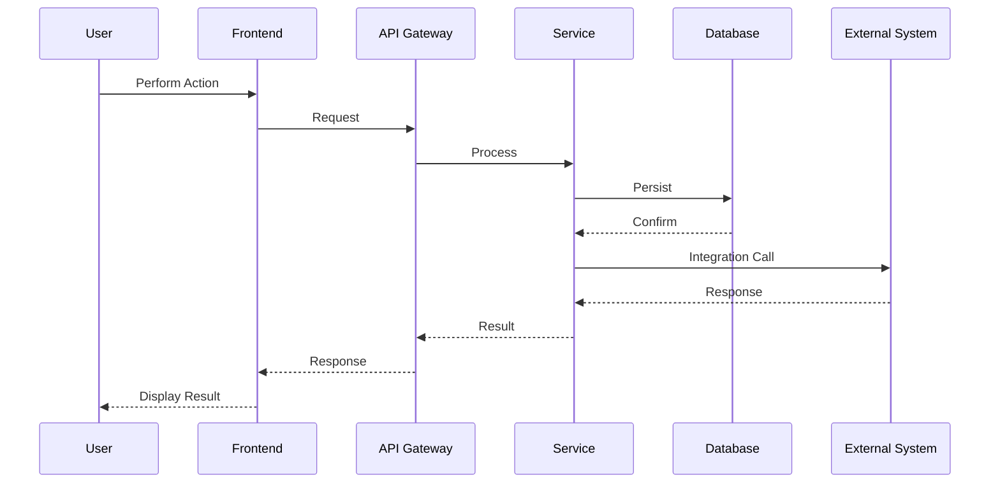
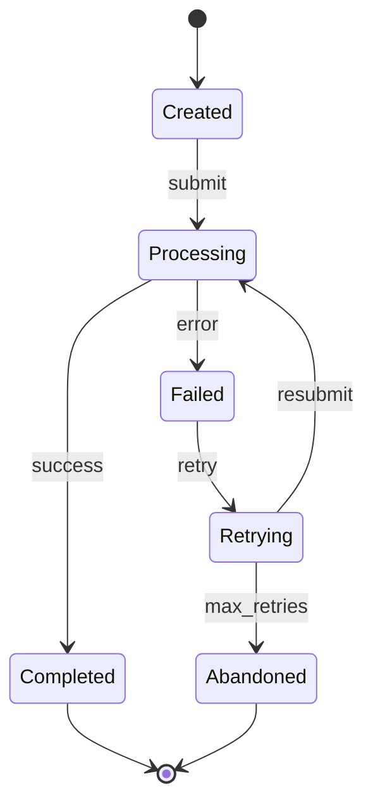

# [System Name] — High-Level Design

**Slug**: `[slug]`
**Version**: 0.1
**Status**: DRAFT | SOCIALIZATION-READY | APPROVED
**Date**: [date]
**Author**: [author]

---

The main purpose of a High-Level Design (HLD) document is to provide a common understanding of the system being developed. It should include enough detail to:

- Explain the system to a new team member joining the project
- Enable a Tech Lead to make confident implementation decisions
- Allow downstream skills (test-strategy, devops-strategy) to use the HLD as input
- Support stakeholder socialization at both technical and executive levels

When writing an HLD:

- Focus on system responsibilities and boundaries, not low-level implementation details
- Link to shared architecture and engineering standards instead of duplicating them
- Distinguish confirmed facts from assumptions — tag every claim with `OBS`, `INF`, or `ASM`
- Reference PRD requirement IDs (R-XXX), NFR IDs (NFR-XXX), and ADR numbers throughout
- Use Mermaid for all diagrams (consistent notation)

> Replace the guidance text below with content specific to your system. Keep the overall section structure unless there is a strong reason to change it.

## 1. Executive Summary

### 1.1 Purpose

Describe what this component/service is and why it exists. Summarise the business problem it solves and the outcomes it enables.

### 1.2 Objectives & Business Value

List the main objectives and business value. Focus on outcomes that stakeholders care about (e.g. reduced operational cost, improved turnaround time, regulatory compliance, better user experience). Reference PRD goals where applicable.

### 1.3 Scope & Non-goals

Clarify what is in scope for this HLD and what is explicitly out of scope. This is especially important when multiple components collaborate.

### 1.4 Key Architecture Decisions

Summarise the handful of most important decisions that shape the design (5–10 bullets). Link to ADRs where they exist rather than duplicating the full rationale.

### 1.5 System Identifier

Document the canonical slug and any short codes used for this system (e.g. `uw-workbench`, `payment-gateway`).

## 2. System Overview

### 2.1 Business Context and Responsibilities

Explain how this component fits into the wider platform. Describe its primary responsibilities and capabilities at a business level.

### 2.2 Stakeholders

List the key stakeholders and how they interact with the system. Include both direct users and indirect stakeholders (e.g. operations, compliance, IT architecture).

### 2.3 Requirements

Summarise the most important requirements.

- **Functional requirements** – core behaviours and use-cases.
- **Non-functional requirements / quality attributes** – performance, availability, scalability, security, observability, etc.

### 2.4 System Boundary and External Interactions

Describe what is considered "inside" this system versus external dependencies. Provide a short bullet list of external systems, services, and data stores.

### 2.5 Context Diagram

Include a C4 Context Diagram (Level 1) showing this system in relation to users and neighbouring systems.

## 3. Architecture Principles

Reference shared platform architecture principles where they exist. Call out which principles are most relevant to this system and where it intentionally deviates from them.

For each principle:
- **Principle name** — one-line description
- **Relevance** — why it matters for this system
- **Deviations** — where and why this system intentionally deviates (if applicable, link to ADR)

## 4. Technology Stack

### 4.1 Core Technologies

List the primary language(s), frameworks, and key versions (e.g. Java, Spring Boot, databases).

### 4.2 Platform / Cloud Services

Describe the cloud services and platforms used (e.g. EKS, DocumentDB, MSK, Redis) and how this component depends on them.

### 4.3 Development & Libraries

Document important internal libraries and shared components (e.g. logging, HTTP errors, domain model libraries) that this service relies on.

### 4.4 Configuration Management

Explain where configuration lives (e.g. Spring Cloud Config, environment-specific YAML) and how environments are separated.

## 5. High-Level Architecture

### 5.1 Context View (if not already covered)

If Section 2 did not already provide a full context view, add a concise description here of where this service sits in the platform.

### 5.2 Container / Service Diagram

Provide a C4 Container Diagram (Level 2) showing major services/containers, data stores, and external systems.

### 5.3 Container / Service Responsibilities

For each container/service in the diagram, list:

- its main responsibilities
- what it explicitly does **not** do (to avoid responsibility creep)

## 6. Component Architecture

Decompose the service into internal components, modules, or layers (e.g. API layer, service layer, repositories, background jobs, integration clients).

- Describe responsibilities and dependencies for each component.
- Call out cross-cutting concerns (auth, validation, caching, retries, idempotency) and where they live.
- Include a component-level diagram if helpful.

## 7. Runtime View

Describe the key flows through the system using sequence diagrams. Reference PRD user flow IDs (e.g., UF-001) where applicable.

- Main happy-path flow(s)
- Important alternative flows (errors, retries, timeouts, degraded modes)
- Interactions with external systems and messaging infrastructure

## 8. Data & Domain Model

### 8.0 Bounded Contexts

Describe the bounded contexts this system encompasses (from the domain model). For each context:
- Name and core responsibility
- Relationship to other contexts (Partnership, Customer–Supplier, ACL, etc.)
- Data ownership boundary

Include a context map diagram if the system has multiple bounded contexts.

### 8.1 Domain Concepts

Describe the core domain concepts/entities this system owns or works with. Keep this aligned with the ubiquitous language and any shared domain models.

### 8.2 Data Model & Persistence

Document what data is persisted where (collections/tables, key fields) and which component owns which data.

### 8.3 Indexing & Access Patterns

Describe the primary access patterns (queries, lookups) and how the data model and indexing strategy support them.

### 8.4 State Transitions

For stateful entities (aggregates), describe the key states and transitions. Include a state diagram for each stateful aggregate.

## 9. Quality Attributes

Explain how the design satisfies the most important quality attributes for this component. For each attribute, link to the relevant shared standard and describe what is specific here.

- **Performance** – expected throughput/latency, hotspots, and how they are mitigated.
- **Availability** – redundancy, failure handling, and graceful degradation.
- **Scalability** – horizontal scaling strategies, statelessness, and bottlenecks.
- **Resilience & fault tolerance** – retries, circuit breakers, timeouts, fallback strategies.
- **Security & compliance** – authentication, authorisation, data protection, regulatory concerns (reference PRD NFR-S* IDs).
- **Observability** – logging, metrics, tracing, and dashboards.
- **Extensibility & maintainability** – patterns that make change safe and localised.

## 10. Operational Concerns

Describe how this service runs in production.

- Deployment topology (pods, regions, AZs).
- Configuration and feature flags.
- Logging, metrics, tracing, and alerting.
- Roll-out / roll-back strategy and dark launches/feature flags if relevant.
- Known failure modes and how operators should respond at a high level.

## 11. API & Integration Contracts (if applicable)

Summarise externally visible APIs and integration contracts.

- Main endpoints and their responsibilities.
- Error semantics and idempotency expectations.
- Event types and topic names if the service publishes or consumes platform events.

Link to canonical API or event schema documentation (OpenAPI, JSON schema) instead of duplicating them here.

## 12. Risks, Trade-offs, and Open Questions

Capture known risks, explicit trade-offs, and open questions. Include findings from the hardening report (Step 9).

### 12.1 Risks

For each risk: description, severity (CRITICAL/HIGH/MEDIUM/LOW), impact, mitigation, owner.

### 12.2 Trade-offs

Where did you knowingly accept complexity or constraints? For each trade-off, link to the relevant ADR.

### 12.3 Open Questions

Unresolved items with owner and target resolution date. Cross-reference with PRD open questions (OQ-XXX).

### 12.4 Assumptions

Things assumed true that need validation. Cross-reference with PRD assumptions (ASM-XXX).

## 13. Future Enhancements

Briefly describe likely future changes or phases and how this design accommodates them. Reference PRD out-of-scope items and DEFERRED decisions.

For each enhancement:
- **Enhancement** — what it is
- **Trigger** — what would cause it to become in-scope
- **Design accommodation** — how the current architecture supports adding it later
- **Estimated impact** — Low / Medium / High effort to implement

<!-- dft:verified:WIgNND1p3slf/WxOrVgSCotLNtT/vIgMQYYEGjC9JsQ=:explore.util.hld-template:0.1.2:2026-09-07T15:00:03Z -->
