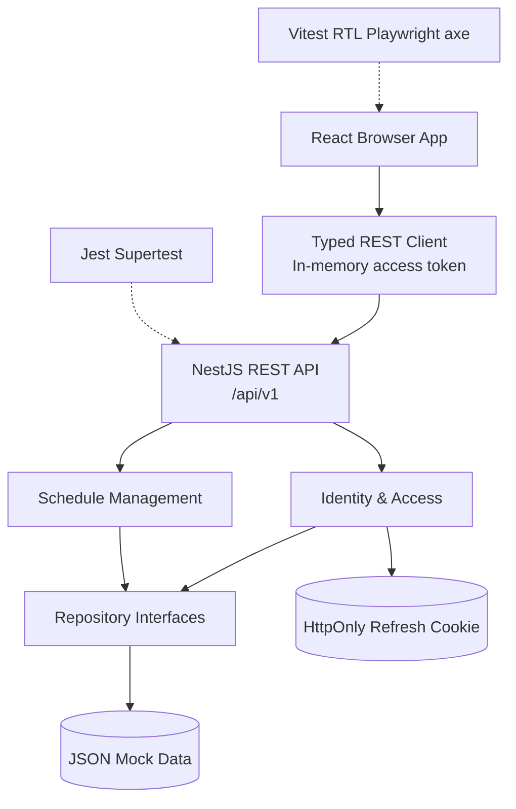

# Technical Plan: Form GYM_SCHEDULER Delivery Epics

## 1. Overview

GYM0001 converts the approved GYM_SCHEDULER product, architecture, quality, and risk artifacts into implementation-ready delivery epics. The prototype will let a seeded gym member log in, view exactly one weekly schedule with seven weekday cards, and manage exercises using a local React/NestJS application backed by a JSON file.

The plan is a bridge to follow-on implementation tasks; it does not itself add application code.

## 2. Goals and Constraints

### Goals

- Provide seeded login with protected schedule access.
- Provide one user-owned schedule with exactly seven ordered days.
- Support exercise add, edit, remove, and explicit ordering.
- Make changes visible after reload/restart through JSON persistence.
- Establish automated unit, integration, browser, accessibility, lint, type-check, and build checks.

### Constraints and Non-Goals

- React + TypeScript frontend; NestJS + TypeScript backend.
- `/api/v1` API prefix; local JSON repository only.
- No MongoDB or PostgreSQL runtime, staging, hosting, registration, social login, sharing, payments, notifications, or advanced analytics.
- Seeded users only; production provider, region, privacy, and durable persistence decisions remain deferred.
- Latest major Chrome, Edge, Firefox, and Safari are supported.

## 3. Related Work and Decisions

Accepted decisions:

- [ADR-001: NestJS Modular Monolith](../../../../explore/decisions/gym-scheduler-adr-001-modular-monolith.md)
- [ADR-002: JSON Repository](../../../../explore/decisions/gym-scheduler-adr-002-json-repository.md)
- [ADR-003: Typed REST Client](../../../../explore/decisions/gym-scheduler-adr-003-typed-rest-client.md)
- [ADR-004: Secure Prototype Session](../../../../explore/decisions/gym-scheduler-adr-004-secure-session.md)

Supporting references:

- [PRD](../../../../explore/prds/gym-scheduler-prd.md)
- [HLD](../../../../explore/hlds/gym-scheduler-hld.md)
- [Boundary map](../../../../explore/hlds/gym-scheduler-boundary-map.md)
- [Test strategy](../../../../explore/explore-gym-scheduler/test-strategy.md)
- [DevOps strategy](../../../../explore/explore-gym-scheduler/devops-strategy.md)
- [Epic index](../../../../explore/epics/README.md)

No other implementation tasks exist. BLK-003 is deployment-only and does not block local development.

## 4. Technical Approach

### Architecture



Use one NestJS process with explicit Identity & Access, Schedule Management, REST API, and Repository modules. Use synchronous in-process calls and no event bus.

### Data Model

```text
User { id, username, passwordHash, role: member | admin }
Schedule { id, userId, days: Day[7] }
Day { id, dayOfWeek, order, exercises: Exercise[] }
Exercise {
  id, name, order,
  muscleGroup?, sets?, repetitions?, restTimeSeconds?,
  difficulty?: beginner | intermediate | advanced,
  instructions?
}
```

The repository guarantees one schedule per user and exactly seven weekday entries. Exercise name is mandatory; optional fields are validated when provided. Domain types and repository ports must not depend on the JSON adapter.

### Session and API

- `POST /api/v1/auth/login`: validate seeded credentials, return short-lived access JWT, set refresh cookie.
- `POST /api/v1/auth/refresh`: rotate a valid refresh session and return a new access token.
- `POST /api/v1/auth/logout`: revoke refresh session and clear cookie.
- `GET /api/v1/schedules/me`: return authenticated user's seven-day schedule.
- `POST /api/v1/schedules/me/days/:dayOrder/exercises`: add exercise.
- `PATCH /api/v1/schedules/me/days/:dayOrder/exercises/:exerciseId`: edit exercise.
- `DELETE /api/v1/schedules/me/days/:dayOrder/exercises/:exerciseId`: remove exercise.
- `PATCH /api/v1/schedules/me/days/:dayOrder/exercises/reorder`: persist explicit order.

Protected operations derive ownership from the authenticated identity, never from a client-supplied user ID. Use standard NestJS HTTP errors and field-level validation details.

### Frontend

Use local React state for authentication, schedule, forms, loading, saved, and error states. The typed REST client owns request types, in-memory access token state, refresh-on-reload behavior, and API error mapping. Do not use browser storage for the access token or add a client cache framework.

## 5. Component Work

### EPIC-GYM-004: Prototype Quality Foundation

- Create frontend/backend TypeScript workspace and scripts.
- Add shared contracts, JSON seed data, repository ports/adapters, and isolated test data.
- Configure Vitest + RTL, Jest + Supertest, Playwright, axe, coverage, lint, type-check, and build.
- Add lean CI checks.

### EPIC-GYM-001: Authentication & Session

- Add seeded users and development-only credentials.
- Implement login, access-token validation, refresh rotation, logout, and protected-route behavior.
- Configure local cookie/CORS behavior without committing secrets.
- Test invalid credentials, unauthorized access, token reuse, and revocation.

### EPIC-GYM-002: Weekly Schedule Board

- Enforce and retrieve one schedule with exactly seven ordered weekdays.
- Build login-to-board flow and responsive seven-card UI.
- Handle empty, loading, saved, unauthorized, validation, and server-error states.

### EPIC-GYM-003: Exercise Management

- Implement add, edit, remove, validation, confirmation, and explicit ordering.
- Keep exercise mutations scoped to the authenticated user's target day.
- Persist changes through the JSON adapter and verify reload/restart behavior.

## 6. Implementation Sequence

1. Workspace, scripts, domain contracts, JSON adapter, seed data, and test harness.
2. Authentication and session behavior.
3. Schedule retrieval and seven-day board.
4. Exercise CRUD and ordering.
5. Browser, accessibility, CI, documentation, and final local verification.

Frontend shell, backend contract tests, domain tests, and CI scaffolding may overlap after shared contracts are stable. Schedule work depends on identity and API contracts; exercise UI depends on schedule retrieval; browser E2E depends on stable local start commands.

## 7. Test Inventory

### Unit

- Domain invariants, validators, token/session services, repository adapter, React components.
- Mock collaborators at ports; preserve coverage floors of 90% line and 85% branch.

### Integration

- NestJS modules, validation, guards, JSON repository, cookies, refresh rotation, ownership, and API contracts.
- Critical flows: login/load board, refresh/logout, exercise lifecycle, cross-user protection.

### Browser and Accessibility

- Login → seven cards → add/edit/remove exercise → reload.
- Keyboard operation, labels, responsive layout, and axe checks for critical states.

### Negative and Smoke

- Reject blank names, invalid optional values, invalid day/order values, malformed IDs, unsupported difficulty, invalid/reused/revoked refresh tokens.
- Verify `401` for unauthenticated protected requests and no sensitive data in errors.
- Smoke login, refresh, schedule retrieval, exercise add, and logout endpoints.

## 8. Acceptance Criteria

- Seeded user can log in and reach the schedule board.
- Exactly one schedule with exactly seven ordered weekday cards is returned.
- Exercise add/edit/reorder/remove works and persists after reload/restart.
- Invalid credentials, missing names, invalid fields, unauthorized access, token reuse, and cross-user access are rejected.
- Frontend maps API states to usable feedback and does not persist access tokens in browser storage.
- JSON storage remains behind replaceable repository interfaces.
- Local lint, type-check, tests, coverage, accessibility checks, and builds pass.
- Follow-on tasks are traceable to the four approved epics with no unresolved architectural choice.

## 9. Risks and Dependencies

- JSON storage is single-process and has no production concurrency guarantee; document and defer migration.
- Cookie/CORS misconfiguration can break refresh; cover with API and browser tests.
- Ownership must be checked on every mutation; centralize auth context and test cross-user attempts.
- Optional field ranges and demo credentials are tactical decisions for the implementation tasks.
- BLK-003 blocks public deployment only, not local prototype work.

## 10. Developer Handoff

Create follow-on implementation tasks for the foundation, authentication, weekly board, exercise management, and final quality work. The first implementation task should produce a runnable local workspace and JSON-backed test baseline. Keep task.md product-readable; put implementation details in each task's plan.

