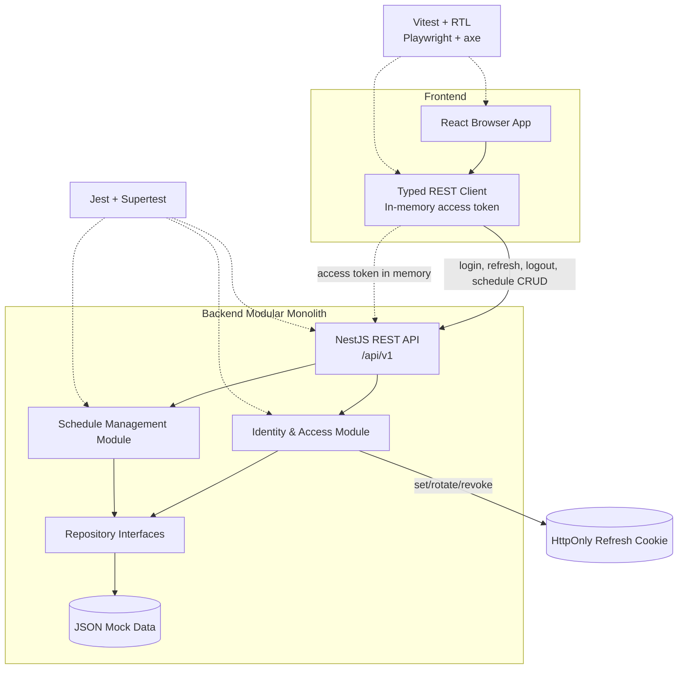

# Architectural Context

## Component Diagram

## Components Involved

- **React Browser App**: Login screen, seven-day board, exercise forms, status feedback, and accessibility behavior.
- **Typed REST Client**: Owns request typing, in-memory access token, refresh-on-reload behavior, and API error mapping.
- **NestJS REST API**: Exposes versioned HTTP endpoints, validation, authentication guards, and response contracts.
- **Identity & Access Module**: Validates seeded credentials, issues short-lived access JWTs, rotates refresh sessions, and handles logout.
- **Schedule Management Module**: Enforces one schedule per user, exactly seven days, ownership, exercise validation, and ordering.
- **Repository Interfaces / JSON Adapter**: Abstracts file-backed mock persistence for users, schedules, and refresh sessions.

## Integration Points

- **HTTP API**: React calls NestJS through `/api/v1`; protected requests carry the in-memory access token and cookies are included for refresh/logout.
- **Refresh cookie**: Backend sets and rotates the Secure, HttpOnly, SameSite refresh cookie; frontend cannot read it.
- **Repository boundary**: Identity and Schedule services depend on interfaces, with the JSON adapter as the prototype implementation.
- **No event bus**: The prototype uses synchronous in-process service calls.

## Test Boundaries

- **Unit tests**: Domain rules, validators, token/session services, repository adapter behavior, and React components; external collaborators mocked at ports.
- **Integration tests**: NestJS modules, validation, auth guards, JSON repository, cookie rotation, ownership, and API contracts together using isolated test data.
- **E2E tests**: Browser login through board loading and exercise lifecycle against the real local frontend/backend processes.
- **Accessibility tests**: Critical login and board states checked with axe and keyboard interaction coverage.

## Downstream Impacts

- The first implementation task must establish workspace scripts and shared API/domain contracts before feature work can run consistently.
- Authentication must land before protected schedule endpoints and the board.
- Schedule retrieval must land before exercise UI mutations.
- Replacing JSON storage later should preserve repository interfaces and service/controller contracts.
- Deployment remains blocked by the existing provider/region/privacy blocker and is intentionally outside this prototype task.

